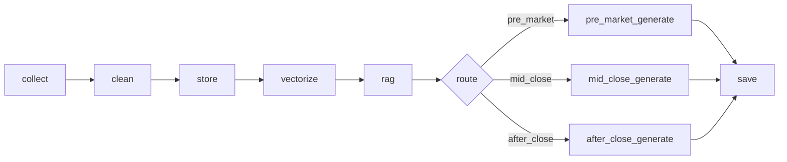

# 金融日报机器人

基于LLM和RAG技术的智能金融日报生成系统，采用LangGraph实现可编排的工作流。

## 功能特性

- **LangGraph工作流**：采用声明式图结构，支持可视化和调试
- **三种报告类型**：盘前早报、盘中快讯、盘后深度总结
- **智能数据清洗**：规则清洗 + LLM智能清洗双重保障
- **RAG增强**：向量检索历史新闻，提供上下文关联
- **自动化调度**：支持定时任务自动生成报告

## 项目结构

```
financial-daily-report/
├── src/                    # 源代码目录
│   ├── main.py            # 主程序入口
│   ├── workflow/          # LangGraph工作流模块
│   │   ├── state.py       # 状态定义
│   │   ├── nodes.py       # 工作流节点
│   │   └── graph.py       # 工作流图
│   ├── collectors/        # 数据采集模块
│   ├── processors/        # 数据清洗模块
│   ├── generators/        # LLM和日报生成模块
│   ├── rag/               # RAG检索模块
│   ├── storage/           # 数据存储模块
│   ├── scheduler/         # 定时调度模块
│   └── utils/             # 工具模块
├── config/                # 配置文件目录
├── data/                  # 数据存储目录
├── outputs/               # 生成报告输出目录
├── docs/                  # 文档目录
│   └── langchain-workflow.md  # LangGraph工作流详细文档
├── tests/                 # 测试目录
│   ├── test_workflow_integration.py  # 工作流集成测试
│   ├── test_workflow_graph.py       # 工作流图测试
│   ├── test_workflow_nodes.py       # 节点测试
│   └── test_workflow_state.py       # 状态测试
├── pyproject.toml         # 项目配置文件
├── .env.example          # 环境变量示例
└── README.md             # 项目说明
```

## 前置要求

- Python 3.10 或更高版本
- uv 包管理器（推荐）

### 安装 uv

```bash
# macOS / Linux / WSL
curl -LsSf https://astral.sh/uv/install.sh | sh

# Windows
powershell -c "irm https://astral.sh/uv/install.ps1 | iex"

# 或使用 pip
pip install uv
```

## 快速开始

```bash
# 1. 克隆项目（如果适用）
git clone <repository-url>
cd Financial-daily-report

# 2. 安装依赖
uv sync

# 3. 配置环境变量
cp .env.example .env
# 编辑 .env 填入你的API密钥和配置

# 4. 立即生成日报测试
uv run python src/main.py run

# 5. 启动定时调度
uv run python src/main.py
```

## 配置说明

项目使用 `.env` 文件进行配置，主要配置项包括：

### LLM 配置
- `LLM_BASE_URL`: LLM服务的基础URL（支持OpenAI兼容接口）
- `LLM_API_KEY`: LLM服务的API密钥（必填）
- `CHAT_MODEL`: 用于对话和生成的模型名称
- `CLEAN_MODEL`: 用于数据清洗的模型名称

### Embedding 配置
- `EMBEDDING_BASE_URL`: Embedding服务的基础URL
- `EMBEDDING_API_TYPE`: Embedding服务类型（`openai` 或 `ollama`，默认：`openai`）
- `EMBEDDING_API_KEY`: Embedding服务的API密钥（可选）
- `EMBEDDING_MODEL`: 用于向量嵌入的模型名称

**支持的 Embedding 服务：**

| 服务类型 | EMBEDDING_BASE_URL | EMBEDDING_API_TYPE | 示例模型 |
|---------|-------------------|-------------------|----------|
| **OpenAI** | `https://api.openai.com/v1` | `openai` | `text-embedding-3-small` |
| **Ollama** | `http://localhost:11434` | `ollama` | `qwen3-embedding:4b-q4_K_M` |
| **vLLM** | `http://localhost:11434/v1` | `openai` | `your-model-name` |

**配置示例：**

```bash
# OpenAI
EMBEDDING_BASE_URL=https://api.openai.com/v1
EMBEDDING_API_TYPE=openai
EMBEDDING_MODEL=text-embedding-3-small

# Ollama
EMBEDDING_BASE_URL=http://localhost:11434
EMBEDDING_API_TYPE=ollama
EMBEDDING_MODEL=qwen3-embedding:4b-q4_K_M

# vLLM
EMBEDDING_BASE_URL=http://localhost:11434/v1
EMBEDDING_API_TYPE=openai
EMBEDDING_MODEL=bge-large-zh-v1.5
```

### 定时任务配置
- `PRE_MARKET_TIME`: 开盘前报告生成时间（格式：HH:MM）
- `MID_CLOSE_TIME`: 中午收盘报告生成时间（格式：HH:MM）
- `AFTER_CLOSE_TIME`: 晚间收盘报告生成时间（格式：HH:MM）

### 日志配置
- `LOG_LEVEL`: 日志级别（DEBUG/INFO/WARNING/ERROR）

## 使用方法

### 立即生成日报

系统支持三种报告类型，每种报告关注不同的市场角度：

```bash
# 生成盘前早报（关注今日预测、美股隔夜回顾、A股开盘预测）
uv run python src/main.py run pre_market

# 生成盘中快讯（关注上午走势总结、行业资金流向、概念板块异动）
uv run python src/main.py run mid_close

# 生成盘后深度总结（关注全日行情回顾、资金面分析、深度市场解读）
uv run python src/main.py run after_close
```

### 启动定时任务

```bash
uv run python src/main.py
```

定时任务会在以下时间自动执行：
- 开盘前 8:30 - 生成盘前早报
- 中午收盘 11:30 - 生成盘中快讯
- 晚间收盘 15:30 - 生成盘后深度总结

## 输出

日报保存在 `outputs/` 目录，格式为 `YYYY-MM-DD_{type}.md`

## 测试

```bash
# 运行所有测试
uv run pytest

# 运行单元测试（排除集成测试）
uv run pytest tests/ -v --ignore=tests/test_workflow_integration.py

# 运行工作流集成测试
uv run pytest tests/test_workflow_integration.py -v -m integration

# 运行特定测试
uv run pytest tests/unit/test_embeddings.py -v

# 运行工作流图测试
uv run pytest tests/test_workflow_graph.py -v
```

### 工作流集成测试说明

`tests/test_workflow_integration.py` 包含三个完整的集成测试：
- `test_full_workflow_pre_market`: 测试盘前早报完整流程
- `test_full_workflow_mid_close`: 测试盘中快讯完整流程
- `test_full_workflow_after_close`: 测试盘后深度总结完整流程

这些测试使用 Mock 对象模拟外部依赖，不需要实际的 LLM 配置即可运行。

## 架构说明

系统采用模块化架构，主要包含以下模块：

### 1. LangGraph工作流模块 (`src/workflow/`)

**状态定义** (`state.py`)：
- `ReportState`: 工作流状态对象，包含所有节点间传递的数据

**工作流节点** (`nodes.py`)：
- `collect_node`: 数据采集节点
- `clean_node`: 数据清洗节点（规则 + LLM）
- `store_node`: 存储到 SQLite
- `vectorize_node`: 向量化并存储到 Chroma
- `rag_node`: RAG 检索历史上下文
- `pre_market_generate_node`: 盘前早报生成节点
- `mid_close_generate_node`: 盘中快讯生成节点
- `after_close_generate_node`: 盘后总结生成节点
- `save_node`: 保存日报节点
- `route_by_report_type`: 条件路由函数

**工作流图** (`graph.py`)：


### 2. 数据采集模块 (`src/collectors/`)
   - 新闻采集器：从 AKShare 采集财经新闻
   - 市场数据采集器：采集股市行情和资金流向数据

### 3. 数据清洗模块 (`src/processors/`)
   - 规则清洗器：基于规则的文本清洗和去重
   - LLM清洗器：使用LLM进行智能清洗和实体提取

### 4. RAG模块 (`src/rag/`)
   - 向量存储：基于ChromaDB的文档向量存储
   - 嵌入生成器：将文本转换为向量
   - RAG检索器：检索相关历史文档作为上下文

### 5. 报告生成模块 (`src/generators/`)
   - LLM客户端：统一的LLM调用接口
   - 日报生成器：生成结构化的金融日报

### 6. 存储模块 (`src/storage/`)
   - 数据库：SQLite数据库存储新闻和报告

### 7. 调度模块 (`src/scheduler/`)
   - 定时调度器：基于APScheduler的定时任务

详细的工作流说明请参考 [docs/langchain-workflow.md](docs/langchain-workflow.md)

## 开发

```bash
# 添加新依赖
uv add <package-name>

# 添加开发依赖
uv add --dev <package-name>
```

## License

MIT License

## 贡献

欢迎提交 Issue 和 Pull Request！
